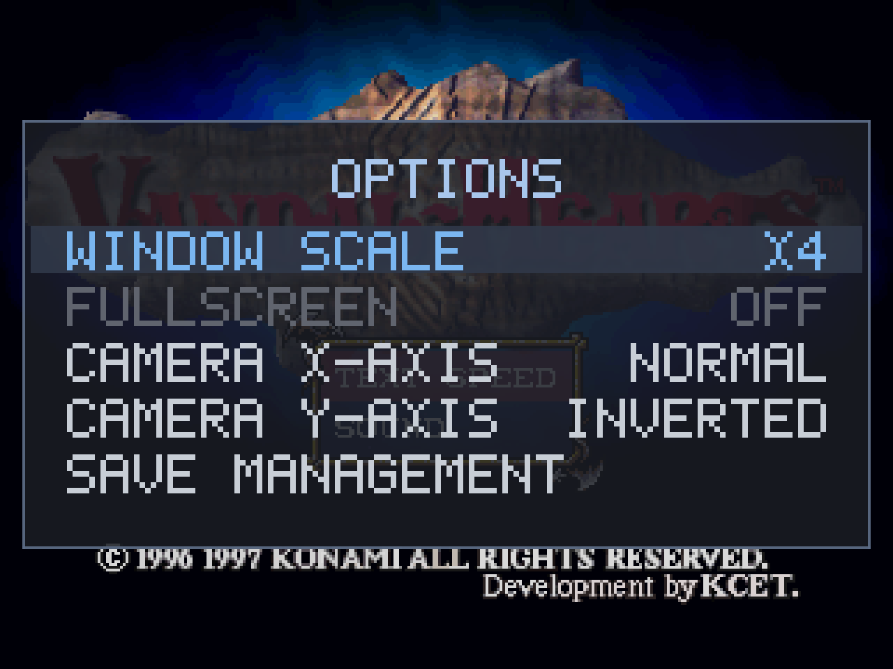

# Controls

The PC port maps a standard gamepad (via SDL2's game-controller layer) and the keyboard onto the
PlayStation controller the game expects. Most functions are the original game's; the PC-port additions
are called out in [Gameplay additions](gameplay-additions.md) and marked **(PC)** below.

Face buttons are positional — the physical **south / east / west / north** buttons map to PlayStation
**Cross / Circle / Square / Triangle**, so the layout is correct on both Xbox-style (A/B/X/Y) and
Nintendo-style pads.

## Gamepad — in battle

| Control | PlayStation button | Function |
|---|---|---|
| D-pad / **left stick** | D-pad | Move the cursor |
| South (A) | Cross | Cancel / back |
| East (B) | Circle | Confirm — select a unit, choose an action, confirm a menu item |
| North (Y) | Triangle | Overhead map view |
| West (X) | Square | **(PC)** Toggle the enemy threat overlay |
| **L1 / R1** (shoulders) | — | **(PC)** Cycle through your units — **L1** previous, **R1** next |
| **Right stick** | — | **(PC)** Camera — horizontal = rotate, vertical = raise/lower the angle |
| L2 / R2 (triggers) | L2 / R2 | Camera elevation (raise / lower the view angle) |
| Start | Start | Battle menu / options; skips an intro movie |
| **Select + Start** (chord) | — | **(PC)** Open / close the in-game options overlay |

Pressing Circle on an empty tile also opens the battle menu (Battle Condition, Turn Over, Zoom, Status,
Options, Save, Load).

## Keyboard — in battle

| Key | PlayStation button | Function |
|---|---|---|
| Arrow keys | D-pad | Move the cursor |
| **S** | Cross | Cancel / back |
| **D** | Circle | Confirm |
| **W** | Triangle | Overhead map view |
| **A** | Square | **(PC)** Toggle the enemy threat overlay |
| **`[` / `]`** | — | **(PC)** Cycle through your units — `[` previous, `]` next |
| **Q / E** | L1 / R1 | Camera rotate (left / right) |
| Enter | Start | Battle menu / options; skips an intro movie |
| Space | Select | Select — used only for the overlay chord below |
| **Space + Enter** (chord) | — | **(PC)** Open / close the in-game options overlay |

## Camera (PC addition)

Vanilla rotates the battlefield camera with the shoulder buttons. The PC port moves camera control to
the **right analog stick** — push left/right to rotate, up/down to raise or lower the viewing angle —
which frees the physical shoulders for the unit-cycle above. The shoulder *buttons* and triggers still
drive the camera too (rotate / elevation), so keyboard and no-right-stick pads keep the original feel.

## Options overlay (PC addition)

Press **Select + Start** together to open a small in-game options overlay; the same chord closes it.
It works everywhere — battle, world map, even over a movie — and it doesn't pause the game (Vandal
Hearts is turn-based, so the field simply idles behind it while it's open).

Navigate with **Up / Down**; change the highlighted setting with **Left / Right** or **Circle**.
Changes apply immediately and are saved to `vandalhearts.ini` right away, so they persist across runs.

### Settings

| Setting | Default | Effect |
|---|---|---|
| **Tactical Mode** *(1.3)* | `OFF` | Opt-in gameplay rebalance — see [tactical-mode.md](tactical-mode.md). Editable **only at the title screen** (greyed during a run); starts a separate save. |
| **Window scale** | `X2` | Window size `X1`–`X8` (integer multiples of native 320×240), applied live. |
| **Fullscreen** | `OFF` | Fullscreen-desktop vs windowed (aspect-preserved, letterboxed). Scale and fullscreen are mutually exclusive — the inactive one greys out, and changing the scale turns fullscreen off. |
| **Camera X-axis** | `NORMAL` | Flips the horizontal (rotate) direction. |
| **Camera Y-axis** | `INVERTED` | Flips the vertical (raise/lower) direction. Ships **inverted** (modern twin-stick: push up = tilt the view down). |

These persist in `vandalhearts.ini`'s `[video]` / `[camera]` sections and can be preset there too — see
[configuration.md](configuration.md).

### Save management

Selecting **Save management** opens a browser of whole-card backups (what it does + why is in
[gameplay-additions.md](gameplay-additions.md#save-management)):

| Button | Action |
|---|---|
| **Square** | Back up the current card to a new timestamped snapshot |
| **Circle** | Restore the selected backup (confirms first; *back up then restore* is the safe default) |
| **Triangle** | Delete the selected backup (confirms) |
| **Start** | Inspect the selected backup — its three slots' chapter / section / level / playtime |
| **Cross** | Back (to the settings, or out of a sub-screen) |

A green **(\*)** marks the backup identical to your current card. Backups live in a hidden
`saves/.archive/` folder next to the game.

### Return to Title *(1.3)*

Selecting **Return to Title** jumps straight back to the title screen from anywhere, skipping the
intro. It confirms first (unsaved progress is lost) and is greyed while you're already at the title.
Available in both normal and Tactical mode.

> **Why a chord, and why no "Close" item:** Start alone skips movies and opens the battle menu, so the
> overlay is bound to Select + Start to avoid clashing. While the overlay is open the game receives no
> input, so a face-button "Close" would have leaked its press to the game behind on the closing frame
> (Circle would pop the battle menu) — hence the chord is the sole open/close, and there is no Close
> entry. Nothing is lost: changes are instant and saved.

Movie playback: press **Start** to skip any intro/cutscene movie.
