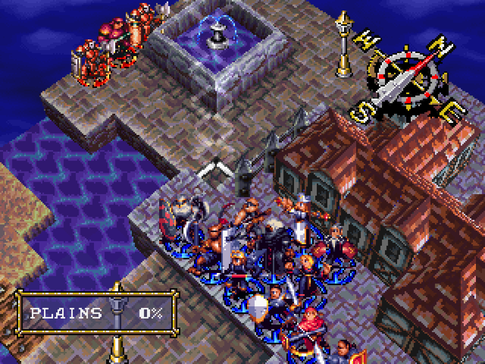
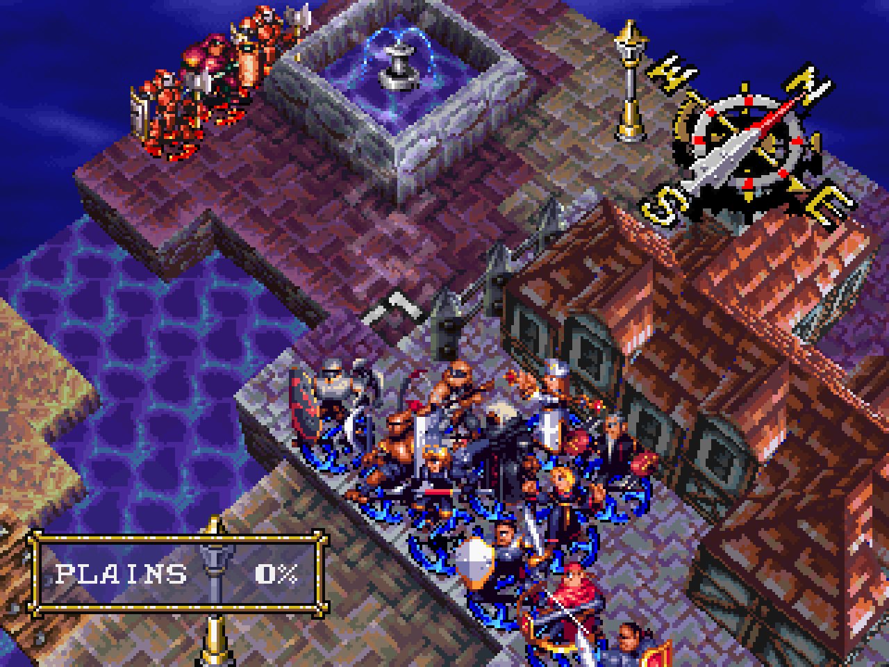
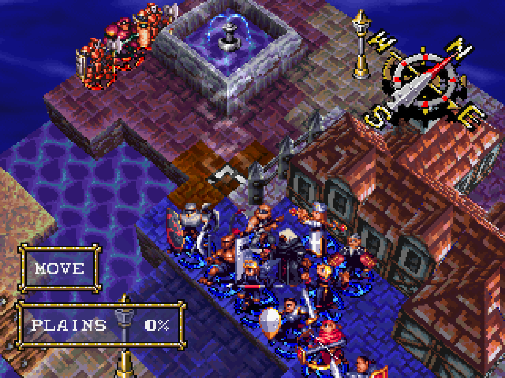
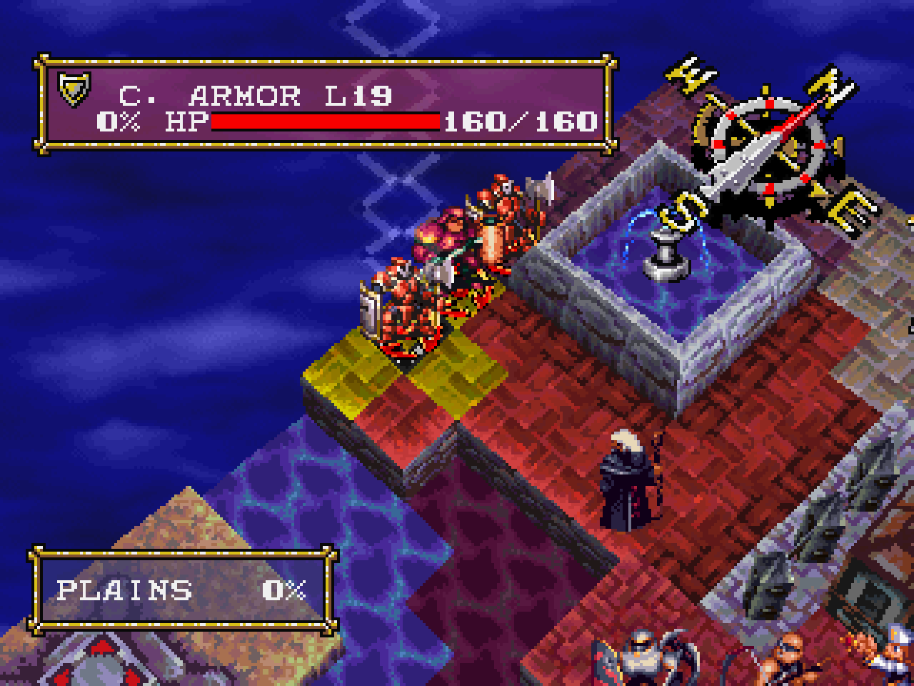
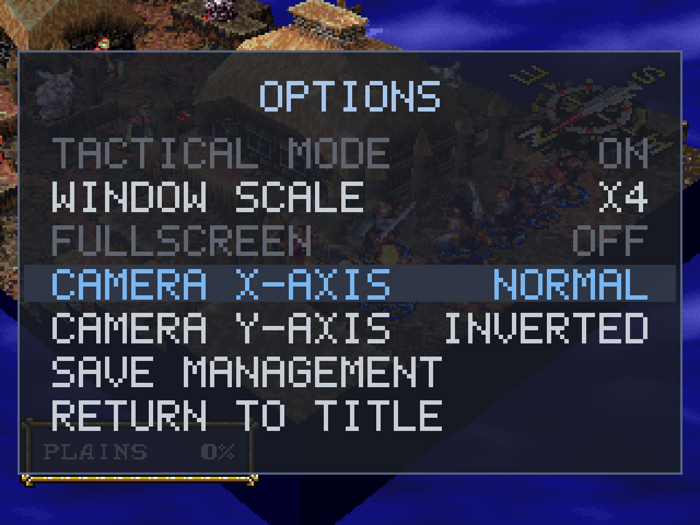
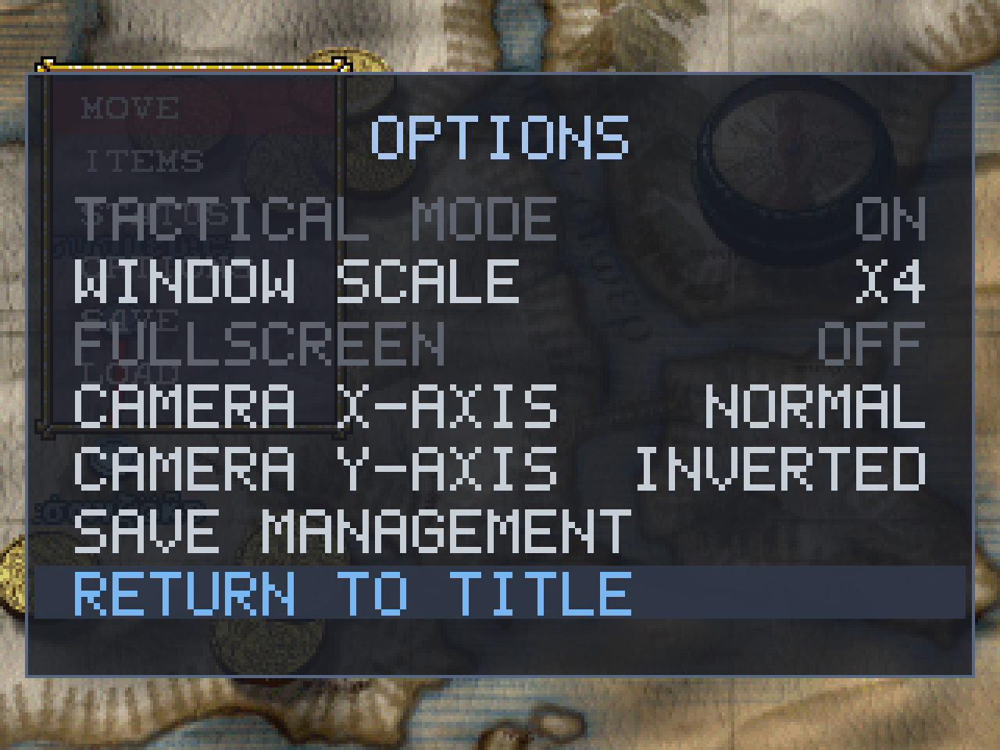
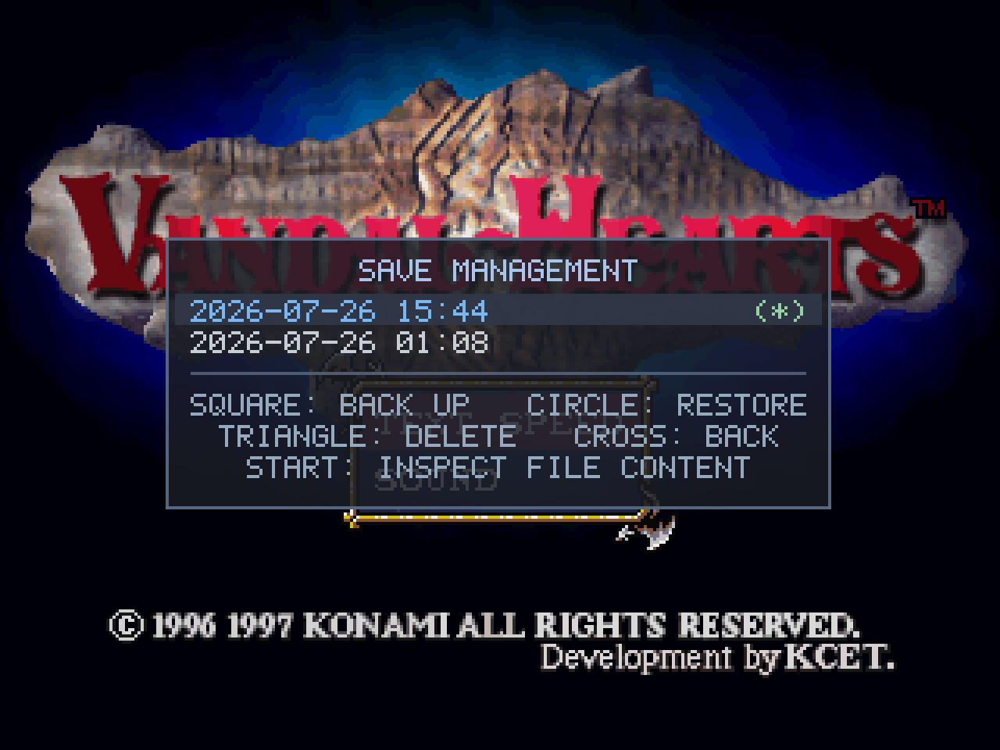
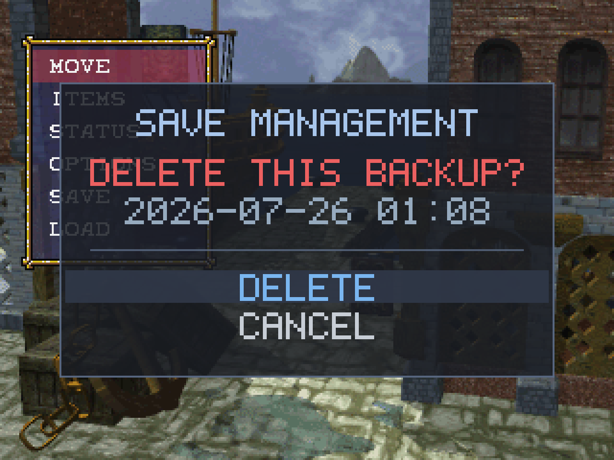
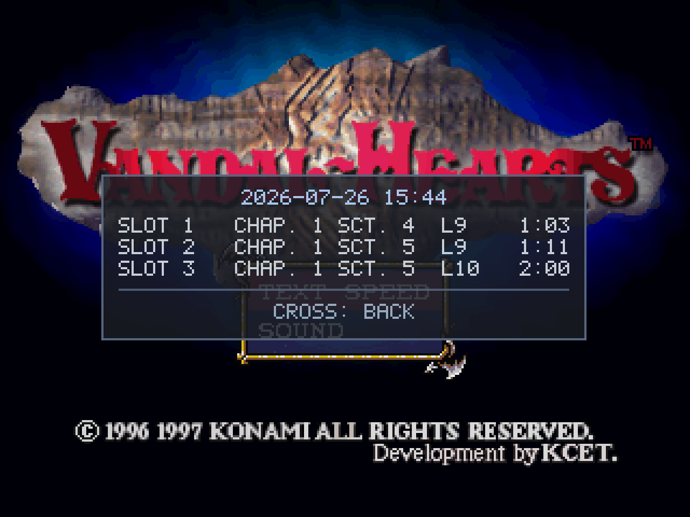
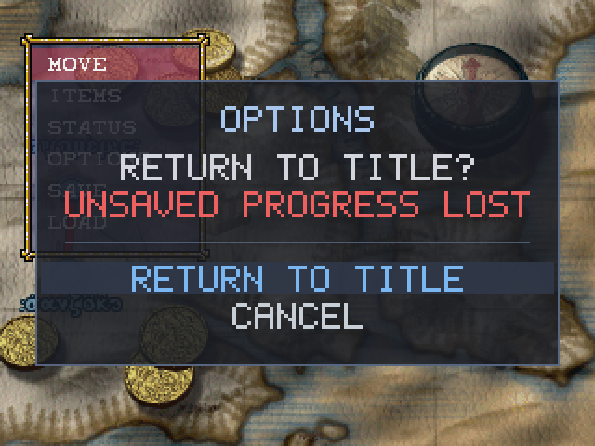

# Gameplay additions (PC port)

Stage 3 adds optional features on top of the faithful port. The quality-of-life additions never change
the underlying game — the vanilla experience is preserved — they just make it nicer to play with a
modern controller. The one feature that *does* change gameplay, **Tactical Mode** (1.3), is strictly
opt-in and isolated, so the faithful mode stays byte-for-byte the original. Everything here is guarded
by the `PC_FEAT` build gate, so the matching decompilation is unaffected. See the [roadmap](roadmap.md)
for what's planned next, and [controls.md](controls.md) for the full button layout.

## Shipped (1.1)

### Twin-stick camera + shoulder unit-cycle

The battlefield camera moves to the **right analog stick** (rotate + raise/lower the angle), freeing
the **shoulder buttons** to cycle through your own units — **L1 = previous, R1 = next** — jumping the
cursor straight to each unit instead of scrolling the map. Cycling skips units that have already acted,
and it's bidirectional, so you can step back and forth naturally. (Vanilla only cycled forward, on
Square.) The shoulder *buttons* and triggers still drive the camera as well, so keyboard players and
pads without a right stick keep the original controls.

### Enemy threat overlay

Press **Square** to toggle a **purple overlay** showing the combined danger zone of **every enemy on
the map at once** — every tile any enemy could move to *and* attack from this turn. It's the fastest
way to plan positioning: you see all the threatened squares in one glance, instead of inspecting each
enemy's range one at a time. (The overlay gently pulses between purple and magenta so it reads clearly
over any terrain.)

Before — a normal battle view:

After pressing **Square** — every enemy's combined move-and-attack danger zone appears at once:

- **Layering & colors:** the overlay sits *below* your own previews, so it never hides what you're
  doing. When you select a unit to move, its **blue** movement range stays visible, and any of its
  reachable tiles that are *also* under threat turn **orange** (reachable **and** dangerous), with pure
  enemy threat beyond in **purple**.

  
- **Distinct from spell targeting:** when you aim a spell or attack, its **yellow** AoE preview draws on
  top — and because reachable-and-threatened is now orange (previously it shared yellow), you can read a
  spell's target area cleanly even inside a danger zone.

  
- **Stays current:** the overlay refreshes automatically when the board changes — a unit moves, a
  crate is pushed, an enemy dies — so it always reflects the real danger. (It updates while you're
  planning at the cursor; during an action animation it hides and reappears, correct, when the action
  completes.)
- **Scope:** it only appears on your turn, and clears at end of turn. Maps with special win conditions
  work the same — it simply shows whatever enemies are present.

Movies (intros/cutscenes) can be skipped at any time with **Start**.

### In-game options overlay

Press **Select + Start** to open a small options overlay anywhere in the game (the same chord closes
it). It doesn't pause — the field idles behind it — and settings apply immediately and save to
`vandalhearts.ini` on the spot.

1.1 ships two settings: independent **invert** for each right-stick camera axis (X = rotate, Y =
raise/lower). The full navigation and the rationale for the Select + Start chord are in
[controls.md](controls.md#options-overlay-pc-addition).

## Shipped (1.2)

The options overlay grew from two toggles into a small menu system — still opened with **Select +
Start**, still no pause.

### Video options

**Window scale** (X1–X8) and **Fullscreen**, applied live and saved to `vandalhearts.ini`'s `[video]`
section. Scale and fullscreen are mutually-exclusive display modes: the inactive one is greyed, and
changing the scale drops fullscreen so your new size is actually shown.

### Save management

Vandal Hearts saves to a single memory card with three slots. Save management lets you keep **unlimited
whole-card backups** and swap them in — each backup stays a byte-identical, real-hardware-valid card, so
nothing here diverges the save format or makes a save unloadable on real hardware.

- **Square: back up** — copy the current card to a new timestamped snapshot.
- **Circle: restore** — replace the current card with a backup. Because this overwrites all three
  slots, it asks first, with **"back up then restore"** as the safe default so you can't lose your
  current save by surprise.
- **Triangle: delete** a backup · **Cross: back**.
- A green **(\*)** marks the backup identical to your current card — a glance tells you where you are,
  and it doubles as a duplicate-spotter (two identical backups both show it).

The one-way actions (**restore** and **delete**) confirm first, with the prompt shown in **red** so an
irreversible operation is unmistakable:

Press **Start** on a backup to inspect it without restoring — the three save slots, each with chapter,
section, Ash's level and playtime (the game's own save caption):

Backups live in a hidden `saves/.archive/` folder next to the game, invisible to the game's own
load/save screens.

## Shipped (1.3)

1.3 adds **Tactical Mode** — a large, opt-in gameplay rebalance — plus two general overlay conveniences.
The rebalance is its own topic; this section covers the overlay-facing additions. The full player guide
to what Tactical Mode changes (level cap, class rebalancing, clarified item content, save isolation) is
in **[tactical-mode.md](tactical-mode.md)**.

### Tactical Mode toggle

A **Tactical Mode** on/off toggle sits at the top of the overlay. It is editable only at the main title
screen (greyed during a run, so a run can't switch modes mid-flight), and its state is remembered in
`vandalhearts.ini`. Turning it on and starting a New Game begins a Tactical run, with its own separate
save folder. Everything it changes is described in [tactical-mode.md](tactical-mode.md) — and none of
it touches the normal mode.

### Return to Title

A **Return to Title** entry lets you jump straight back to the title screen from anywhere — no need to
reset the application or sit through the intro again. Because it abandons unsaved progress, it asks for
confirmation first, with the warning shown in red and **Cancel** a button away:

This one is available in **both** modes (it's a plain convenience, not a Tactical change). It's greyed
out while you're already at the title screen.

## In development (1.4)

> **Status: in development** — implemented and in playtesting; will move to *Shipped* when 1.4 releases.

### Battle fast-forward

A battle-only **2× speed** for quicker play. During a battle, tap **R2** (or the `.` key) to run at
double speed; **L2** (or `,`) returns to normal. A small **`BATTLE SPEED X2`** readout shows top-right
while it's active. It works **only inside a battle** — menus, the world map, cutscenes and movies always
play at normal speed — and it **resets to 1× automatically** when the battle ends, so it never carries
into the next battle or the overworld.

The speed-up is *whole-tick*: the game runs its complete update steps closer together in time, never
skipping or splitting one, so **the AI, RNG and every outcome are identical to normal speed** — only the
idle wait between frames is compressed. Because it changes nothing about what the game computes, it
applies in **both** normal and Tactical mode (it isn't a balance change).

On a gamepad this reuses the physical **L2 / R2 triggers**. Vanilla used those for camera elevation; the
port had already moved the camera to the right stick, so the triggers were free — nothing is lost, and
the right stick still raises/lowers the view. See [controls.md](controls.md#battle-fast-forward-pc-addition-14).

### Controller-aware overlay labels

The port overlay's own button hints now match your controller. A **Button labels** setting (in the
Select + Start overlay) switches the footers between **Xbox** letters (A / B / X / Y) and **PlayStation**
symbols (□ ○ △ ✕). It defaults to Xbox — the common PC controller — and a PlayStation player flips it
once; the choice is saved to `vandalhearts.ini`. This is deliberately limited to the port's **own**
overlay (save management, options) — the game's in-battle prompts are left exactly as the original.

## Planned

See the [roadmap](roadmap.md).
