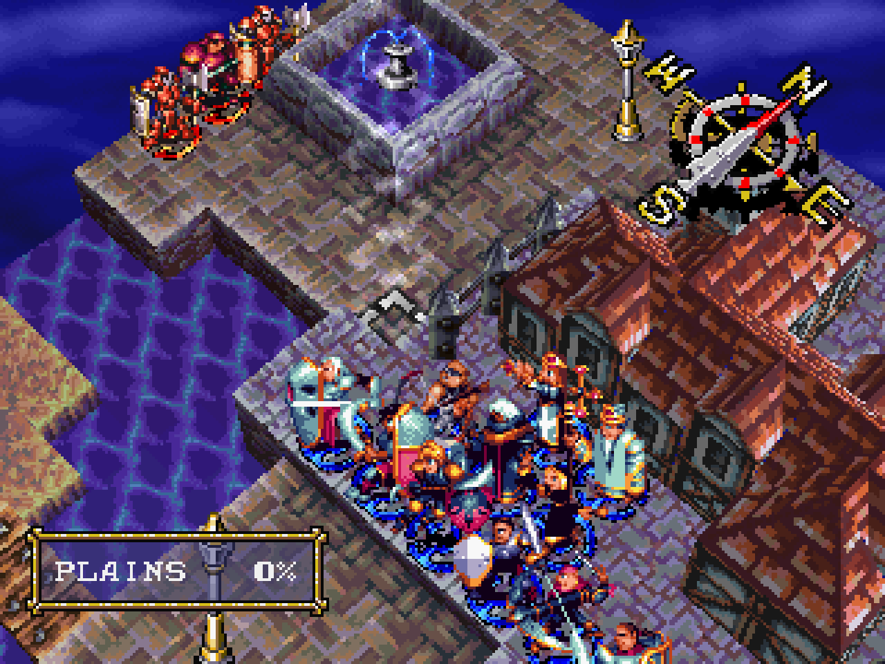
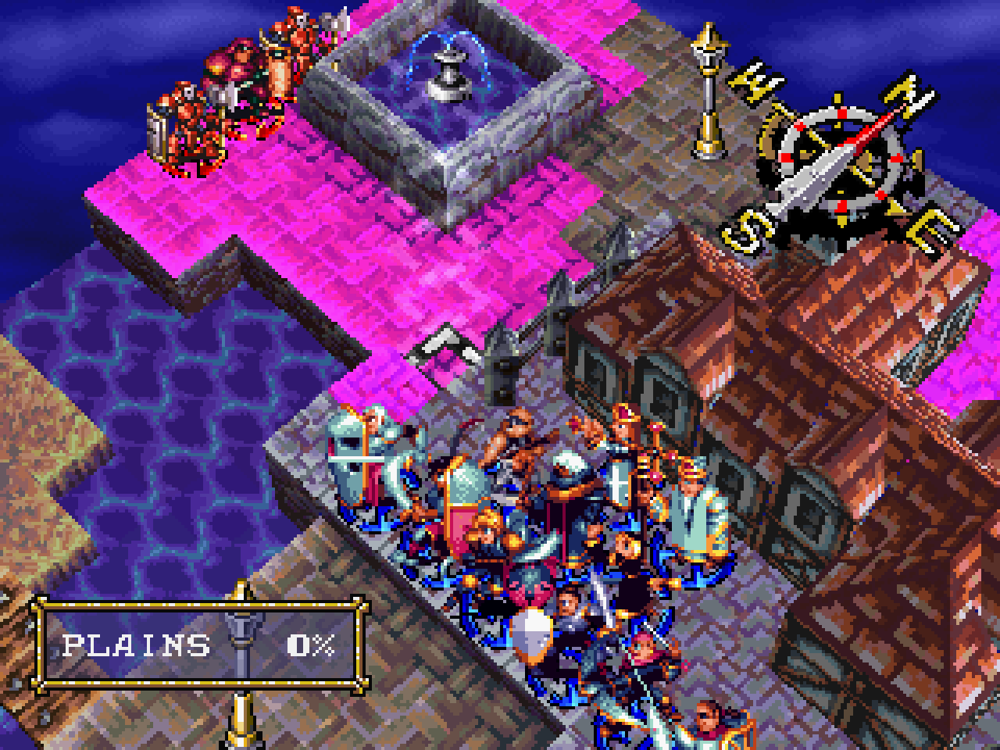
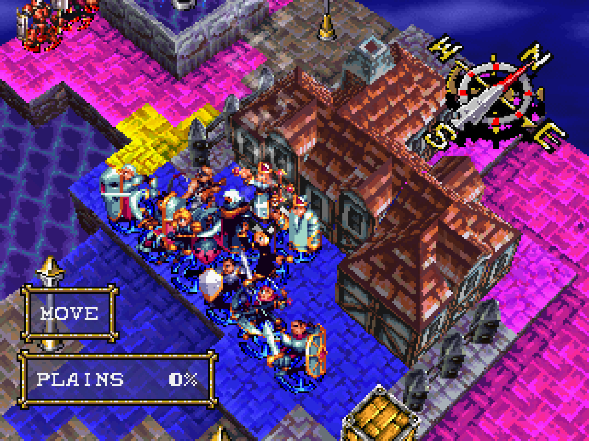
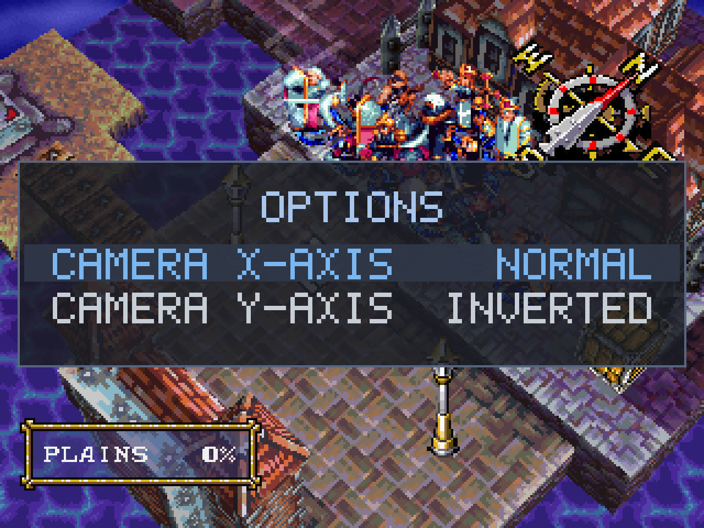
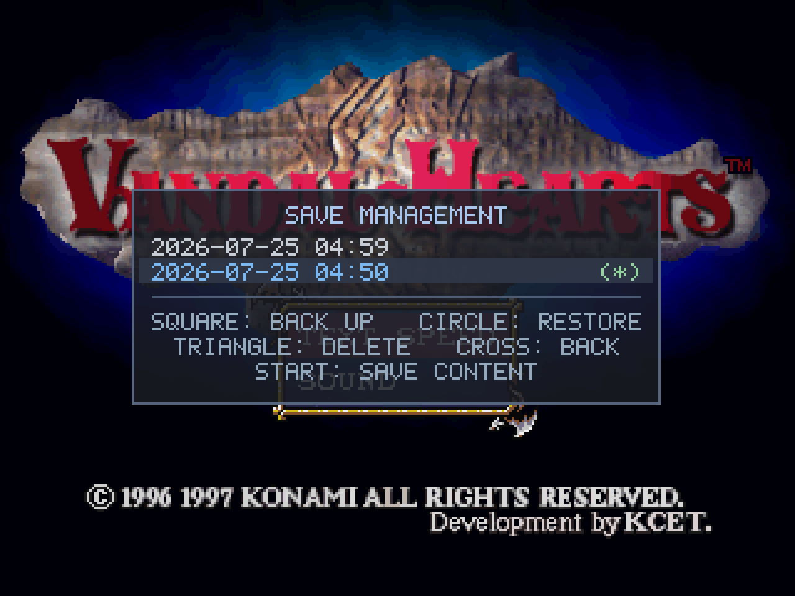

# Gameplay additions (PC port)

Stage 3 adds optional quality-of-life features on top of the faithful port. They never change the
underlying game — the vanilla experience is preserved — they just make it nicer to play with a modern
controller. Everything here is guarded by the `PC_FEAT` build gate, so the matching decompilation is
unaffected. See the [roadmap](roadmap.md) for what's planned next, and [controls.md](controls.md) for
the full button layout.

## Shipped (1.1)

### Twin-stick camera + shoulder unit-cycle

The battlefield camera moves to the **right analog stick** (rotate + raise/lower the angle), freeing
the **shoulder buttons** to cycle through your own units — **L1 = previous, R1 = next** — jumping the
cursor straight to each unit instead of scrolling the map. Cycling skips units that have already acted,
and it's bidirectional, so you can step back and forth naturally. (Vanilla only cycled forward, on
Square.) The shoulder *buttons* and triggers still drive the camera as well, so keyboard players and
pads without a right stick keep the original controls.

### Enemy threat overlay

Press **Square** to toggle a **purple overlay** showing the combined danger zone of **every enemy on
the map at once** — every tile any enemy could move to *and* attack from this turn. It's the fastest
way to plan positioning: you see all the threatened squares in one glance, instead of inspecting each
enemy's range one at a time. (The overlay gently pulses between purple and magenta so it reads clearly
over any terrain.)

Before — a normal battle view:

After pressing **Square** — every enemy's combined move-and-attack danger zone appears at once:

- **Layering:** the overlay sits *below* your own previews, so it never hides what you're doing. When
  you select a unit to move, its blue movement range stays visible — and any of its reachable tiles
  that are *also* under threat turn **yellow** (reachable **and** dangerous). When you target a spell
  or attack, that preview shows on top of the threat.

  
- **Stays current:** the overlay refreshes automatically when the board changes — a unit moves, a
  crate is pushed, an enemy dies — so it always reflects the real danger. (It updates while you're
  planning at the cursor; during an action animation it hides and reappears, correct, when the action
  completes.)
- **Scope:** it only appears on your turn, and clears at end of turn. Maps with special win conditions
  work the same — it simply shows whatever enemies are present.

Movies (intros/cutscenes) can be skipped at any time with **Start**.

### In-game options overlay

Press **Select + Start** to open a small options overlay anywhere in the game (the same chord closes
it). It doesn't pause — the field idles behind it — and settings apply immediately and save to
`vandalhearts.ini` on the spot.

1.1 ships two settings: independent **invert** for each right-stick camera axis (X = rotate, Y =
raise/lower). The full navigation and the rationale for the Select + Start chord are in
[controls.md](controls.md#options-overlay-pc-addition).

## Shipped (1.2)

The options overlay grew from two toggles into a small menu system — still opened with **Select +
Start**, still no pause.

### Video options

**Window scale** (X1–X8) and **Fullscreen**, applied live and saved to `vandalhearts.ini`'s `[video]`
section. Scale and fullscreen are mutually-exclusive display modes: the inactive one is greyed, and
changing the scale drops fullscreen so your new size is actually shown.

### Save management

Vandal Hearts saves to a single memory card with three slots. Save management lets you keep **unlimited
whole-card backups** and swap them in — each backup stays a byte-identical, real-hardware-valid card, so
nothing here diverges the save format or makes a save unloadable on real hardware.

- **Square: back up** — copy the current card to a new timestamped snapshot.
- **Circle: restore** — replace the current card with a backup. Because this overwrites all three
  slots, it asks first, with **"back up then restore"** as the safe default so you can't lose your
  current save by surprise.
- **Triangle: delete** a backup · **Cross: back**.
- A green **(\*)** marks the backup identical to your current card — a glance tells you where you are,
  and it doubles as a duplicate-spotter (two identical backups both show it).

Press **Start** on a backup to inspect it without restoring — the three save slots, each with chapter,
section, Ash's level and playtime (the game's own save caption):

Backups live in a hidden `saves/.archive/` folder next to the game, invisible to the game's own
load/save screens.

## Planned

See the [roadmap](roadmap.md). Next is **1.3** — an opt-in balance mode — which slots into the same
overlay as another entry.
