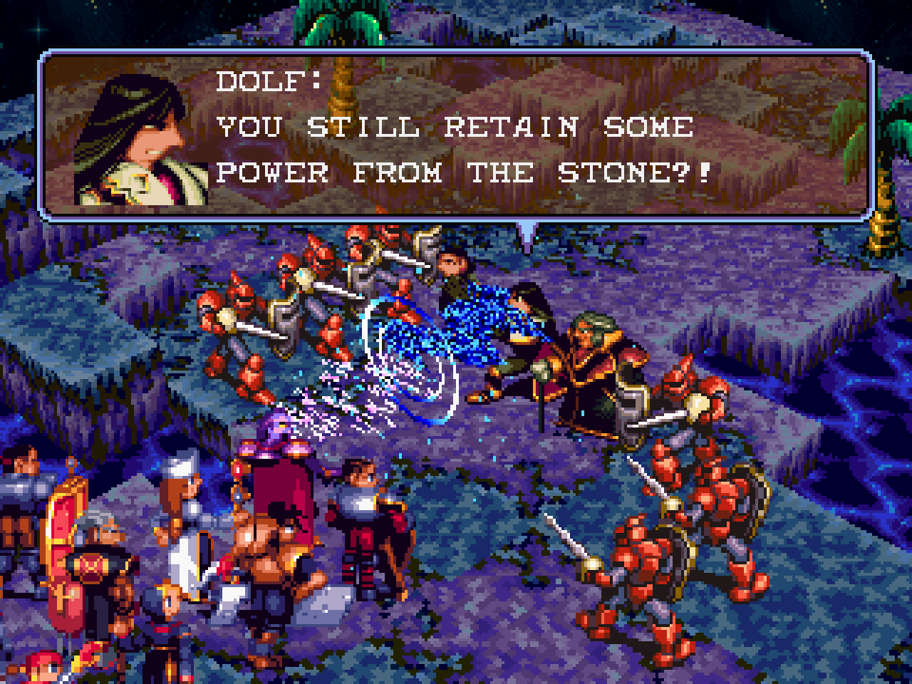

# Known Issues

A short, honest list of the defects and limitations we're already aware of — so you can check here
before filing a report. If you hit something that **isn't** listed, please do report it.

Some background on scope: the game's original logic is reproduced byte-for-byte, and the normal
(non-Tactical) mode is unaffected by the gameplay work. The items below are almost entirely in the
**port's rendering/backend layer** (Stage 2 audio/visual fidelity) and therefore apply to both modes,
unless noted otherwise.

## Graphics

### Certain casting "ray" effects render coarser than on hardware

- **What you'll see:** the blue energy "zip" / lightning-ray casting effect — most noticeable in a
  **Chapter 2 cutscene**, though the same effect appears on other casts (e.g. Thunder Flash). On real
  hardware it's a spray of **thin, translucent light-blue/white rays** you can see terrain and units
  through. In the port it can look like a **denser, blockier additive cloud**, and its exact appearance
  varies from run to run (the effect is timing/RNG-driven).

  
- **Status:** **under investigation — non-blocking, cosmetic.** A separate bug that made these effects
  drop their texture entirely (rendering as a flat filled shape) was **fixed in 1.3.1**; what remains is
  a subtler difference — the effect is now correctly textured and translucent, but the fine ray pattern
  reads coarser than hardware.
- **What's been ruled out:** every structural cause we can measure has been verified to match the
  original hardware — primitive type, texture data, colour palette, per-pixel transparency, blend mode,
  texture windowing, and the 3D geometry/projection itself. The remaining suspect is a subtle
  texture-sampling nuance in the software renderer (nearest-neighbour sampling aliasing a fine streak
  texture that the PS1 GPU reads more smoothly). It affects both modes and is purely visual.

## Not bugs — by design

- **Avalanche debris (Tactical Mode).** The Tactical ice re-skin re-textures only the main boulder; the
  tumbling debris behind it is drawn from fixed rock sprites and stays rocky by design (a full snow
  effect would need new artwork). See [tactical-mode.md](tactical-mode.md#avalanche--an-ice-re-skin).
- **macOS.** Only **Windows** and **Linux** are supported. macOS is scaffolded in the build but not
  built or tested — see [cross-platform.md](cross-platform.md).

---

*Reporting anything else:* open an issue with the location (chapter/battle), what you expected vs. what
you saw, and a screenshot if it's visual. For rendering issues, a comparison against a screenshot from
original hardware or an accurate emulator is especially helpful.
