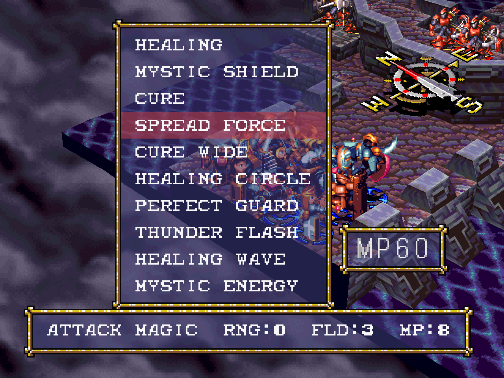
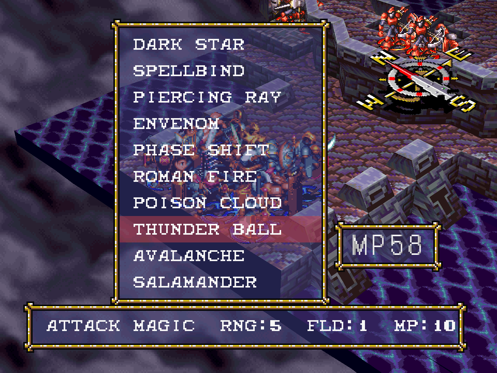
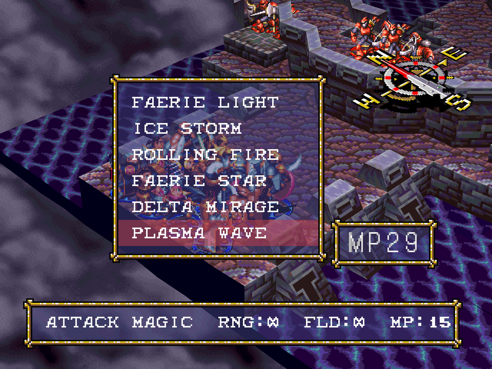

# Tactical Mode

**Tactical Mode is an optional, opt-in rebalance of Vandal Hearts** — a second way to play for people
who want a tighter, more deliberate tactical experience than the retail game offers. It is **off by
default and fully isolated**: the normal game stays byte-for-byte the original, and Tactical saves live
in their own place, so turning it on never touches a vanilla playthrough.

> **Status: released as an opt-in mode.** Everything here is implemented, playable, and validated across
> a full playthrough. Normal mode is unaffected. See the [roadmap](roadmap.md) and
> [changelog](../CHANGELOG.md).

Since v2.0 Tactical Mode also runs on the **Japanese game**, with its reworked text kept faithful
to the Japanese disc: the clarified item descriptions reuse the disc's own Japanese spell lines,
and the adjusted spell info lines are the retail Japanese text with only the numbers updated.

## Design goals

**Tactical Mode doesn't aim to make the game harder — it aims to make it more varied.** Retail Vandal
Hearts contains a handful of exploits and design choices that push an "optimal" playthrough toward
ignoring several characters and whole classes. The mode targets those specifically:

- **Experience exploits** enabled by the Bishop/Archbishop buffs and MP transfer spells, which snowball
  the party 10–30 levels above the content.
- **Trials of Toroah** whose enemies scale to *Ash's* level, so benching Ash trivializes them — and
  which otherwise exist only to unlock the hidden Vandalier class.
- **The Armored path** (Guardsman/Dragoon) having mobility too poor to justify fielding over its Knight
  counterparts.
- **The Monk/Ninja path**, built around agility — a stat Vandal Hearts never actually implements —
  while competing with the AoE-master Sorcerer/Enchanter and the long-range Bishop/Archbishop healers.
- **The Vandalier**, whose retail "ultimate class" leans on a leftover debug path that grants all spells
  and infinite item use, turning Ash into a one-man army.

Every change below applies **only in Tactical Mode**; in the normal mode they all keep their exact
retail values.

## Turning it on

Open the in-game options overlay (**Select + Start**) and set **Tactical Mode** to **ON**.

- The toggle is editable **only at the main title screen** — everywhere else it is shown but greyed, so
  a run can never switch modes underneath itself.
- Start a **New Game** with it on to begin a Tactical run. The choice is saved to `vandalhearts.ini`, so
  it persists between sessions.
- **Saves are separate.** Tactical saves go to their own folder (`saves_tactical/`), and the game's own
  Load/Save screens only ever show the current mode's card, so a vanilla save and a Tactical save can't
  be loaded into the wrong mode. Each save also carries a small internal marker, so even a hand-moved
  file lands back in the right mode.

## Changes

### Experience & the level cap

**Intent — stop the snowball, and bring the combat math back to life.** The support-cast experience
exploit lets a party run 10–30 levels ahead of the enemies it faces. Beyond the raw stats and spells
that come with levels, Vandal Hearts' combat model makes the *level gap itself* a dominant damage
factor — and a large gap can even break enemy AI targeting, producing incoherent behavior.

Experience is now **capped per chapter**, so a unit can catch up to the party but never run away from
the content:

| Chapter | 1 | 2 | 3 | 4 | 5 | 6 |
|---|--:|--:|--:|--:|--:|--:|
| Level cap | 10 | 15 | 19 | 24 | 28 | 32 |

The curve climbs a steady **+4 per chapter** after the opening chapter (starters begin at level 5–6, so
chapter 1 is a +5 ramp), and chapter 6's cap of **32** lands the endgame party right on the final
boss's level — validated across a full playthrough.

- The instant a unit reaches its chapter's cap it stops gaining experience — so the
  repeat-a-support-spell exploit simply stops paying out.
- Because the cap rises each chapter, a well-played party sits right at the edge of the curve —
  challenged, never trivial.
- Keeping the party near enemy level restores meaning to mechanics the old level gap papered over:
  **damage mitigation**, and the **inherent class differences** in tanking physical vs magical damage.
- The cap doubles as natural **spell pacing**: higher-tier spells come online around the chapter whose
  cap reaches their level.

### Trials of Toroah

**Intent — make Ash matter, and make the Trials worth clearing on their own.** Retail Trials copy
**Ash's** level onto their enemies, so leaving Ash at home makes them trivial; and outside of unlocking
the Vandalier in chapter 6, they offer little reward for the consumables and time they cost.

- Trial enemies now spawn at the **current chapter's cap**, tuned to a well-played party's ceiling no
  matter who you field. Benching Ash no longer keeps them easy.
- Clearing a Trial now grants **gold and experience**, calibrated to that chapter's final-battle values
  (regular enemies, not the boss), compensating the consumables and time an early clear demands.
- Losing a unit in a Trial now carries a **gold penalty**, also scaled to the chapter's final battle —
  the Trials are a resource source, but not a free one.

The level-cap override is split across two files because the Trial enemies are set up on a path
where `gState.chapter`/`gState.mapNum` are still in flux: at spawn time the chapter cap is applied
instead of copying Ash's level (`states/game_setup.c`), and the enemies keep `expMulti 0` — retail's
attack-XP multiplier for Trial enemies — plus a chapter-scaling override in `battle/evaluators.c` that
can land on the wrong chapter while those globals are unstable. By the time XP is actually computed
(`battle/math.c`, `CalculateAttackDamage`), chapter and map are stable, so the fix forces both values
there instead: it restores a per-chapter attack-XP multiplier and the correct `expScalingLevel`.
Mutating the enemy's `expMulti` and the global scaling level at that point is persistent and harmless,
since both values only ever feed XP.

### Guardsman & Dragoon — mobility

**Intent — make the Armored path an active front-line choice.** Guardsman/Dragoon are the party's
physical tanks and top physical damage dealers, but their mobility made them impractical to field over
the Swordsman/Duelist line. Reading the code showed the real culprit wasn't horizontal range but
**vertical traversal** — their poor ability to climb elevation. Movement in Vandal Hearts is a single
`step` **profile** that bundles horizontal range, climb ceiling, and terrain cost together, so each
change swaps the whole profile:

- **Guardsman → Bowman profile (`step 1 → 5`).** Movement range stays **5**; climb ceiling improves
  (**+1 → +2**). Verticality only — no extra horizontal reach.
- **Dragoon → Sniper profile (`step 4 → 6`).** Gains **1 movement** (**5 → 6**) and the improved climb.

The Swordsman/Duelist line keeps its edge in two areas — one more horizontal tile than the Armored path,
and neutral (non-vulnerable) magic defense — so the choice stays meaningful.

### Monk & Ninja — full rework

**Intent — give the path a reason to exist.** More than any other, the Monk/Ninja needed a ground-up
pass: it's a hybrid (inherently harder to balance), and almost everything in retail worked against it.

- Its kit is built around **agility**, which the game never implements as a mechanic.
- It's outclassed at both ends: Bishop/Archbishop are long-range specialist healers (their Supreme
  Healing is a whole-map heal — literally `range 255 / field 255`) *and* the engine of the experience
  exploit this mode kills; Sorcerer/Enchanter own AoE with Phase Shift and Salamander.
- It leans on its spell list yet has **half the MP pool** of the other casters.

**Foundation changes:**

- **MP pool** brought to exact caster parity (`2 × level`) — `gClassMpMultiplier` **1 → 2**, and the
  retail Monk-only `+advLevelFirst` promotion bonus (which existed to soften the half rate) is dropped
  in Tactical so the two don't stack and overshoot. The `reqLv ≤ 10` base spells are kept through the
  second path-B promotion (`states/game_setup.c`, `PopulateUnitSpellList`), so an early Monk/Ninja spell
  doesn't drop off the list once the class promotes again.
- **Magic resistance** improved to sit between the caster and frontline tiers — `magicSusceptibility`
  **3 → 2** (weaker than Priest/Mage, stronger than Swordsman/Duelist).
- **Claws** raised to match their tier's other weapons — Panzer Claw real power **10 → 12**, Dragon Claw
  **12 → 13**.

**Reworked spell list** (bold = changed from retail):

| Spell | area | target | rng | field | power | mp | effect | reqLv |
|---|---|---|--:|--:|--:|--:|---|---|
| **Spread Force** | AOE | enemy-grp | 0 | 3 | **8** *(13)* | **8** *(7)* | damage | 12 |
| Cure Wide | AOE | ally-grp | 0 | **3** *(1)* | 1 | **6** *(4)* | cure | 15 |
| Healing Circle | AOE | ally-grp | 0 | **3** *(1)* | 15 | 6 | heal | 17 |
| Perfect Guard | single | ally | **6** *(4)* | 0 | 1 | **12** *(15)* | AGL+ (negate 1 hit) & **magic resist** | 19 |
| Thunder Flash | AOE | enemy-grp | 0 | **3** *(2)* | 14 | **14** *(12)* | damage | 21 |
| Healing Wave | AOE | ally-grp | 0 | **3** *(2)* | 28 | **12** *(10)* | heal | 23 |
| Mystic Energy | **AOE** (single) | **ally-grp** (ally) | **0** (4) | **3** (0) | 1 | **35** (15) | Defense buff **& magic resist** | 25 |

The Monk/Ninja now learns **Spread Force** — a low-power, no-range group hit that rewards standing in
the formation — in place of retail's redundant Stone Shower (see *Sorcerer & Enchanter* below for where
Stone Shower's slot went). **Thunder Flash** trades a wider field for a higher cost; the two group heals
are separated into distinct roles — **Healing Circle** a cheap, efficient top-up, **Healing Wave** the
heavy heal. **Perfect Guard** is cheaper and now also confers magic resistance (see below).

**Mystic Energy — redesigned.** Retail Mystic Energy was a single-target ATK/DEF buff — underwhelming
for a level-25 spell and overcosted against the Priest line's dedicated ATK and DEF buffs. It's now a
true ultimate: a costly, potent defensive bubble around the Ninja.

- `target`: single → **ally-group**
- `range`: 4 → **0**  ·  `field`: 0 → **3**  ·  `mp`: 15 → **35**
- `effect`: grants **defBoost 3** and **magic resistance 1** to every ally in the field until the start
  of the next player turn.
- Now casts as a true area buff — an icy-blue protective aura on each ally in range, with a "DEF up"
  indicator (the boost is defensive only).
- Its in-battle info line reads **"Protect Magic"** (v2.0) — the same wording as Perfect Guard,
  matching the redesign's protective identity (the old "DEF,AT Up" text described the retail spell,
  which no longer raises ATK).

For reference, the normal defense buff (Mystic Shield) grants only defBoost 1, and magic resistance 1
matches the caster line's own resistance. It has strong synergy with the Dragoon — soaking a late-game
magic barrage — but its cost is deliberately steep: at 35 MP, casting it twice in a row costs more than
a full late-game caster pool, so a second consecutive cast needs an MP-refill item. A tactical tool, not
a spammable one.

**The resulting identity:** a hybrid that *wants* to be near the front line, supporting allies and
poking magic-weak enemies.

- All support spells share one shape (`range 0, field 3`); all attack spells share another
  (`range 0, field 2`) — the class rewards standing inside the formation.
- The exception is **Perfect Guard**, whose extended range lets the Ninja hold the front while still
  bubbling a threatened backliner. In Tactical it also grants **magic resistance** for a turn, turning
  it into a single-unit "evasion + anti-magic" shield — a cheap, targeted way to protect a magic-weak
  ally right before an enemy caster's turn (its description was always "Protect Magic"; now it is).
- Versus the Knight/Armored frontliners, Monk/Ninja are physically weaker but more magic-resistant,
  immune to ailments, and carry AoE ailment cure.
- Bishop/Archbishop remain the best healers, but Monk/Ninja bring unique support and can still heal
  nearby allies when needed. Sorcerer/Enchanter remain the long-range AoE kings, but Monk/Ninja damage
  is no longer negligible — they can now finish enemies with their own kit, at the cost of being in
  melee range.

The reworked list in game:

**Origin spells are kept.** Both promotions retain their three origin spells — Huxley/Sara their first
three Priest spells, Eleni/Zohar their first three Mage spells. (An earlier revision dropped them at the
Ninja tier for a cleaner list; playtesting showed that was a needless nerf to a path that doesn't need
one, so they stay.) The retained basics keep real niche value late — a cheap top-up heal, a longer-range
single-target cure, a mini defense buff, or a paralyze poke — so the class stays flexible rather than
losing utility on promotion.

### Sorcerer & Enchanter — spell tuning

**Intent — give the mage kit two more reasons to reach.** Two targeted changes complement the Monk/Ninja
rework:

- **Roman Fire power `7 → 9`.** In retail it's strictly overshadowed by Phase Shift (learned two levels
  earlier, wider field); at power 9 it matches Phase Shift's punch, so its longer range and lower cost
  become a real niche against clustered or distant foes.
- **Thunder Ball added.** The Monk/Ninja rework hands the mages' old Stone Shower slot over to a new
  **Thunder Ball** — a long-range, small-area attack spell — filling the gap where Stone Shower used to
  sit and giving the caster a precise ranged option distinct from the big-field Phase Shift / Salamander.

| Spell            | area    | target        |   rng | field |     power |     mp | effect     | reqLv  |
| ---------------- | ------- | ------------- | ----: | ----: | --------: | -----: | ---------- | ------ |
| Dark Star        | single  | enemy         |     4 |     0 |         1 |      2 | DAMAGE     | 1      |
| Spellbind        | single  | enemy         |     5 |     0 |         1 |      2 | PARALYZE   | 8      |
| Piercing Ray     | AOE     | enemy-grp     |     4 |     1 |         2 |      4 | DAMAGE     | 10     |
| Envenom          | single  | enemy         |     5 |     0 |         1 |      3 | POISON     | 12     |
| Phase Shift      | AOE     | enemy-grp     |     0 |     7 |         9 |     12 | DAMAGE     | 14     |
| Roman Fire       | AOE     | enemy-grp     |     5 |     2 | **9** (7) |      6 | DAMAGE     | 16     |
| Poison Cloud     | AOE     | enemy-grp     |     5 |     2 |         1 |      4 | POISON     | 19     |
| **Thunder Ball** | **AOE** | **enemy-grp** | **5** | **1** |    **13** | **10** | **DAMAGE** | **21** |
| Avalanche        | single  | enemy         |     6 |     0 |        18 |      9 | DAMAGE     | 23     |
| Salamander       | AOE     | enemy-grp     |     0 |    10 |        13 |     14 | DAMAGE     | 25     |

### Avalanche — an ice re-skin

**A cosmetic touch.** Avalanche is thematically a wall of snow and ice, yet its retail effect is a
rolling boulder of grey stone. In Tactical the boulder is re-skinned as ice — a translucent, brightly-lit
crystalline mass — to match the spell's name. Normal mode keeps the original stone.

Only the main boulder is re-textured; the tumbling debris behind it is drawn from fixed rock sprites, so
it stays rocky — reading as an ice-and-rock slide. A full snow effect would need new artwork.

### Vandalier — reined in

**Intent — let it be the ultimate class without being a solo win button.** The Vandalier, unlocked
through the Trials, reaches its retail power via a leftover **debug** path that grants *all* spells and
infinite item use. In practice Ash can solo chapter 6 — it's even the *fastest* way to finish it: fewer
units to move, effectively infinite HP/MP through items, and Plasma Wave as a whole-map nuke. That
overshadows what actually makes the Vandalier special:

- Unique weapons and armor well beyond what any other unit can equip.
- The best class in the game statistically by a wide margin (`gAdvantage` table).

Those alone are more than enough to feel ultimate — and reining in the rest brings the *other* party
members back into the final chapter.

- **Removed** the `gState.debug` hook that gave the Vandalier all spells and all items.
- **Kept Plasma Wave** on its spell list — the signature power-fantasy cast survives, but it's now
  MP-limited like any spell, with the infinite-MP item loop gone. Mechanically, unit setup
  (`SetupPartyBattleUnit`/`SyncPartyUnit`) writes `SPELL_PLASMA_WAVE` directly into the unit's first
  free spell slot whenever its weapon is the V-Heart, rather than through the usual `gSpellLists`-append
  path — so the spell never leaks onto Ash's other promotions and never indexes past
  `gSpellLevelRequirement`'s 36 entries.

### Clarified item descriptions

The mystery `?????` items found on hidden tiles now describe what they do, and the generic "attack
magic item" blurbs are rewritten to name their actual effect.

| Item | Retail | Tactical |
|---|---|---|
| Mad Book | `??????????` | Casts Spellbind |
| Mushroom | `??????????` | Casts Poison Cloud |
| Fire Gem | Attack magic item | Burn enemies in field |
| Moon Pie | `??????????` | Casts Self Healing |
| Mood Ring | Attack magic item | Crushes foes in rings |
| Iron Boot | `??????????` | Casts Perfect Guard |
| Aura Gem | Attack magic item | Mega light attack |
| Unicorn | `??????????` | Casts Rainbow Storm |
| Kingfoil | `??????????` | Casts Healing Circle |
| Helstone | `??????????` | Casts Thunder Ball |
| Wyrmfang | Attack magic item | Huge rings of fire |
| Shiv Book | `??????????` | Casts Dagger Storm |
| Necklace | `??????????` | Casts Dark Hurricane |

### Magic-aware enemy casters

Everything above makes magic resistance *matter* — the `magicSusceptibility` rebalance, and the resistance
that **Perfect Guard** and **Mystic Energy** now grant. But retail's enemy AI is **blind** to it: it scores
targets without any magic-resistance term, so it will happily fire a spell straight into your most
resistant unit, and the buffs you spend a turn setting up do nothing to deter it.

Tactical Mode closes that gap. Enemy spellcasters now **weigh magic resistance when choosing a target** —
biasing toward magic-weak units and away from resistant or buffed ones. So a shielded backliner or a
Mystic Energy'd cluster genuinely reads as a *worse* target to the enemy, and the defensive tools this mode
adds finally pull their weight on defense. It's a bias layered on top of the original targeting math, not a
rewrite, and it's **Tactical-only** — normal mode's AI is untouched. The full targeting model (and why
retail behaves the way it does) is in
[game-mechanics/ai-decision-making.md](game-mechanics/ai-decision-making.md).

The term is tuned rather than dominant: `score += (magSusc − 3) × 30` (the weight lives as
`PC_AI_MAGSUSC_K` in `battle/ai.c`). A resistant target (`magSusc` 1 or 2) gets −60 or −30; a weak one
(4 or 5) gets +30 or +60 — only a 30-point edge over a neutral target, so advantage, HP and terrain
stay live tiebreakers and a well-matched neutral unit can still be picked over a weak one. The term
needs no magic-only gate: it only runs in the damage-scoring branch, which is reached exclusively for
magic spells (physical attacks score through the separate attack scorer, above), and every damage
spell already scales with `magSusc` in the damage formula itself.

## Implementation notes

*For maintainers; players can skip this section.* The mode lives in
`platform/pc/src/pc_balance.c` / `pc_balance.h`, a PC-side unit that is never part of the matching
build. Game-side reads of `gTacticalMode` sit in `src/` behind `#ifdef PC_FEAT`.

### The runtime patch

Tactical values are a single **restorable, idempotent patch** over the game's mutable global tables:
each patched location is an (address, size, tactical value) record with a snapshot of the pristine
bytes. `PC_SyncBalance()` applies the tactical values when `gTacticalMode` is set and writes the
snapshot back when it is not, enforcing the invariant `patchApplied == gTacticalMode`; it must run
after every mode change (boot, the overlay toggle, load-adopt, return to title). The snapshot is
taken lazily on the first sync — after the generated data has populated the tables and before any
patch — so Normal mode presents pristine values no matter how often a session switches modes.

- Pointer-table swaps (item and spell descriptions) pass the pointer through the record's `tac`
  field, which is `unsigned long long` on purpose: `unsigned long` is 32-bit on Windows (LLP64).
- Fixed-width string patches (`gSpellNames[]` is a `char[][21]` array, not a pointer table) copy in
  place and must fit the record width; a longer replacement — a mis-built language pack — is logged
  and skipped rather than overrunning the next record.
- The Tactical layer's text is translatable: every authored string is offered to the active language
  pack by content (`PC_LangStr`) once, at patch-build time.
- Diagnostics: `VH_SPELL_DUMP=1` logs each unit's advancement fields and resulting spell list;
  `VH_BALANCE_DUMP=1` prints the patched spell fields after apply.

### Level caps

`TacticalCap(chapter)` returns 50 (the retail cap) in Normal and, in Tactical, the chapter's cap with
`chapter` clamped to `[1, 6]` (chapter 1 is a valid Trial index):

| Chapter | 1 | 2 | 3 | 4 | 5 | 6 |
|---|--:|--:|--:|--:|--:|--:|
| Cap | 10 | 15 | 19 | 24 | 28 | 32 |

The starters begin at level 5–6, so chapter 1 is a +5 ramp; every later chapter adds a uniform +4,
and 32 is the final boss's level. A steeper early curve leaves the party 2–3 levels under cap by
chapters 3–4, while smaller late steps let area casters hit the cap mid-chapter and waste the
chapter-5 Trial and final-battle XP; the uniform +4 avoids both.

### Trial rewards

A cleared Trial pays like **that chapter's final battle**: the four per-chapter tables are the final
battle's own values read from the retail binary (regular enemies; bosses get no 2× tier). All are
indexed by `gState.chapter` clamped to `[1, 6]` — one Trial map replays across chapters — and are read
only by the `PC_FEAT` Trial hooks, always under `gTacticalMode && mapNum <= 5`.

| Chapter | 1 | 2 | 3 | 4 | 5 | 6 | Retail Trial |
|---|--:|--:|--:|--:|--:|--:|--:|
| Attack-XP scaling level (`TrialExpScalingLevel`) | 9 | 14 | 17 | 21 | 26 | 29 | — |
| Enemy XP multiplier (`TrialEnemyExpMulti`) | 12 | 15 | 16 | 15 | 12 | 21 | 0 |
| Gold per kill (`TrialGoldReward`) | 170 | 330 | 660 | 1040 | 1820 | 2700 | 10 |
| Gold lost per player-unit death (`TrialGoldPenalty`) | 110 | 220 | 440 | 700 | 1200 | 1800 | 10 |

### Class rework constants

Every value below is one patch record in `ensureInit()`:

| Change | Table | Retail → Tactical |
|---|---|---|
| Guardsman mobility (Clint/Grog/Dolan) | `gUnitInfo[{26,31,32}].step` | 1 → 5 (Bowman profile) |
| Dragoon mobility | `gUnitInfo[{50,55,56}].step` | 4 → 6 (Sniper profile) |
| Monk/Ninja magic resistance (Eleni/Huxley/Sara/Zohar) | `gUnitInfo[{28,29,34,35,52,53,58,59}].magicSusceptibility` | 3 → 2 |
| Monk MP pool | `gClassMpMultiplier[CLASS_MONK]` | 1 → 2 |
| Panzer Claw / Dragon Claw | `gItemEquipmentPower[ITEM_P_CLAWS]`, `[ITEM_D_CLAWS]` | 10 → 12, 12 → 13 |
| Roman Fire | `gSpells[11].power` | 7 → 9 |
| Chapter-4 opener XP | `gBattleExpScalingLevels[29]` | 16 → 18 (the only downward dip in maps 10–43; its neighbours are 17 and 18) |

`step` selects a whole movement profile — range, climb ceiling and terrain cost — see
[game-mechanics/classes.md](game-mechanics/classes.md).

**Spell-slot swaps.** Two swaps make spells 13 and 26 class-exclusive so their stats and level
requirements tune freely:

- **Spell 13 (Spread Force)** becomes Monk-only: power 13 → 8, MP 7 → 8, `gSpellLevelRequirement`
  21 → 12 (Stone Shower's retail level). `gSpellLists[{4,5,10,11}][1][3]` — the Monk path's slot 3 for
  Eleni/Huxley/Sara/Zohar — point at it.
- **Spell 26 (retail Stone Shower)** becomes the mage's Thunder Ball: range 5, field 1, power 13,
  MP 10, level 21 (Spread Force's retail level). Its `gSpellsEx` main/target/defeat objects
  (224/128/129) are copied from spell 41, the item-cast Thunder Ball, which itself stays untouched
  because enemy unit 124 casts it. `gSpellLists[{4,11}][0][7]` — the mage path's slot 7 for
  Eleni/Zohar — point at it. Stone Shower is dropped in Tactical only; no enemy, item or code path
  casts it.
- The name in `gSpellNames[26]` is patched in place. On the Japanese game it is the katakana
  サンダーボール: the JP renderer draws full-width Shift-JIS names, and an ASCII name renders blank in
  the spell list and the cast banner.

**Mystic Energy (spell 32)**, beyond the stat changes in the table above:

- `gSpellSounds2[32]` 0 → 911. Retail Mystic Energy is single-target and has no per-target hit
  sound; as an ally-group buff the per-target loop in `battle/executors.c` plays `gSpellSounds2` once
  per ally, so it mirrors the cast sound — the same `Sounds1 == Sounds2` pattern Cure Wide uses.
- `gSpellsEx[32][OBJF_TARGET]` 113 → 112. Both are the lightweight `OBJF_CASTING_STAT_BUFF` object
  (so the swap stays AOE-safe); 112 is Mystic Shield's blue-CLUT variant of retail's green 113. The
  floating stat-up text is keyed off the aura CLUT (`Objf681_StatBuffFx`): BLUES shows only "DF up!",
  REDS "AT up!", GREENS both — so the recolor also drops the misleading "AT up!" for a defense-only
  buff. `OBJF_DEFEAT` is left alone: an ally buff never reaches the defeated-target path.
- The defBoost / magic-resistance effect itself is a `PC_FEAT` hook in the game source, not a table
  patch.

**Cut weapons stay cut.** The Bloodaxe (item 35) and Kill bow (item 23) are enemy-commander weapons
(the Bloodaxe belongs to Dallas and generic troopers, the Kill bow to Lando), not unused content;
both items are byte-for-byte retail in Tactical.

### Text swaps

- **Item descriptions.** `gItemDescriptions` (single-line) and `gItemDescriptions2` (shop) are
  pointer tables, both defined with the retail strings in the generated `pc_item_descriptions.c`;
  Tactical repoints entries 8–11 and 88–96 at authored text (the table under *Clarified item
  descriptions*). On the Japanese game the nine `?????` items instead reuse the disc's own spell
  description, `gSpellDescriptions[gItemSpells[id]]` — those spells (63–71) take no Tactical patch, so
  the baked numbers stay correct — and items 8–11 need no swap because the JP retail text already
  states the specs.
- **Spell info lines.** The in-battle spell-info bar draws `gSpellDescriptions[]`, a baked string
  with range/field/MP hardcoded rather than read from `gSpells`, so every reworked spell's line is
  repointed too. US lines copy the retail format and spacing. JP lines are the retail string with
  only the numerals swapped (`<retail prefix> 射程R 範囲F 消費ＭＰn`; a full-width digit *d* is the
  Shift-JIS pair `0x82, 0x4F + d`). Spell 32 borrows spell 29's protective prefix in both regions
  ("Protect Magic" / 物理攻撃を防御): the retail "ATK/DEF up" wording would misdescribe a defense-only
  buff.

### Save cards and the mode marker

Each mode uses its own save folder, and every card also carries the mode inside the file:
`CardFileData_Header.padding[0]` — file offset 68 — is `'T'` (0x54) in Tactical and 0 in Normal
(`stampSaveMarker`, run from every sync). The game never touches `padding` (`core/card.c`), so the
stamp rides inside a hardware-valid save. `PC_AdoptSaveMode()` reads the marker before a load and,
when it disagrees with the current mode, adopts the card's mode and re-syncs — a hand-moved file
lands in the right tables. The Japanese card header shares the US layout up to and including
`padding[28]` at offset 68 — JP only appends a third icon frame at the tail (512 vs 384 bytes) — so
the marker offset holds in both regions.

## A note on the numbers

Tactical Mode has been validated across a full playthrough, but it stays a living design — a few spell
powers and costs may still be fine-tuned in later point releases. The one guarantee that won't change is
the promise at the top of this page: **the normal mode stays exactly the game as it shipped.**
