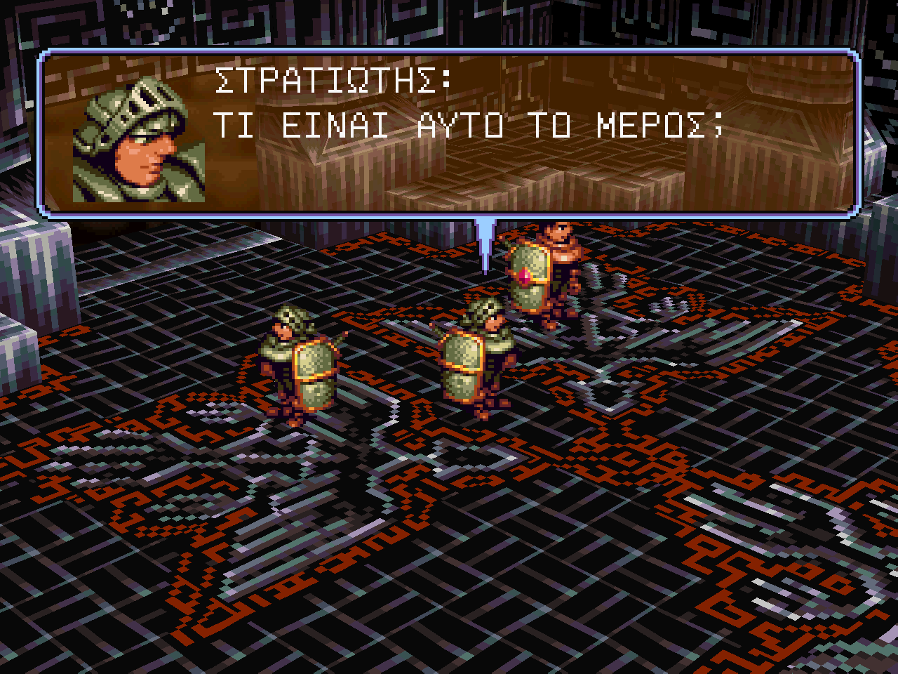
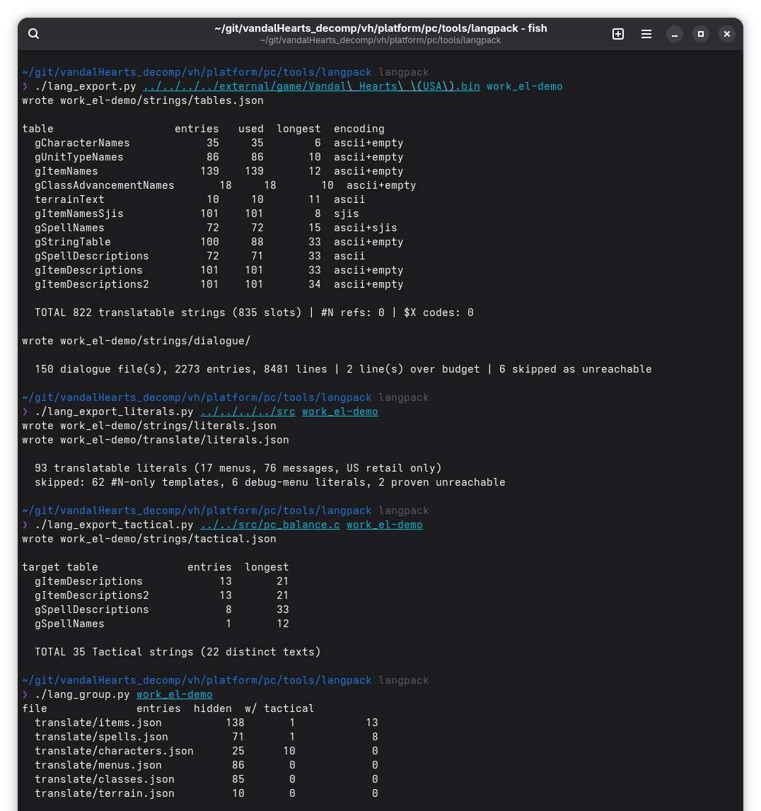
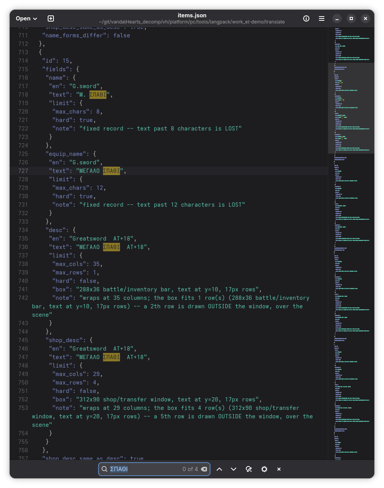
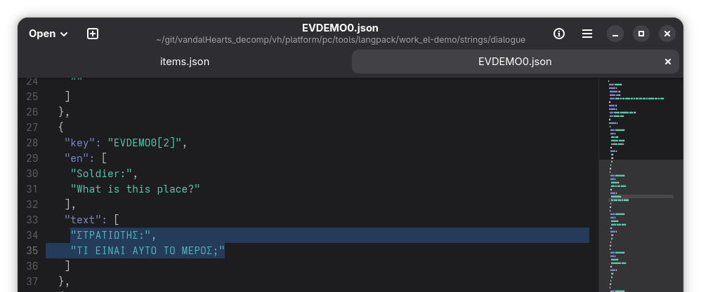
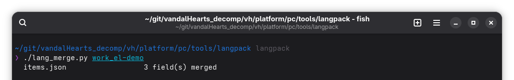
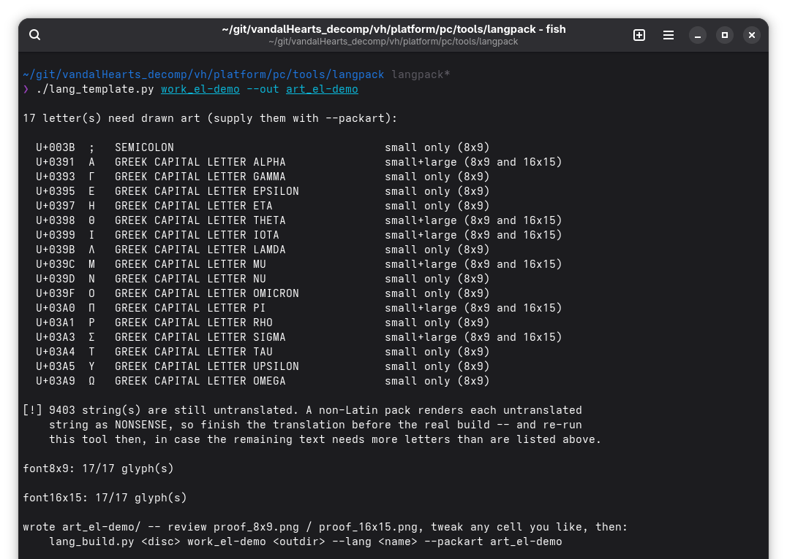
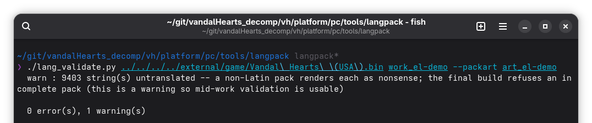
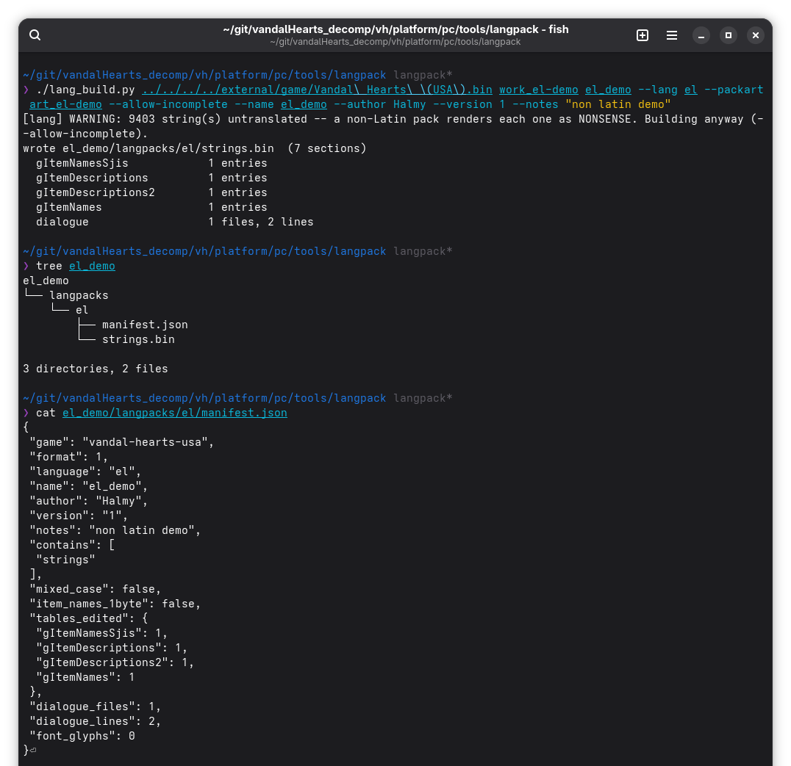
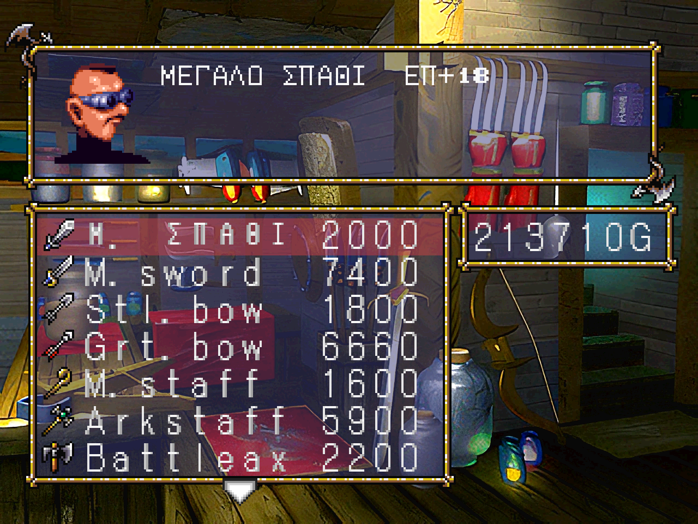

# Language-pack quickstart

A hands-on walkthrough that builds a small **Greek** language pack from scratch and runs it in the
game. Greek is a *non-Latin* script, so this covers the **full** path — including drawing the glyph
art. A Latin-script pack (French, Italian, …) is the same but **skips step 4 and the `--packart`
flag**; see [`README.md`](README.md) for the reference and the exact Latin vs non-Latin split.

Every command is run from `platform/pc/tools/langpack/`. `<disc>` is your own disc image; the scripts
are executable (`./lang_export.py …`). Non-Latin art needs Pillow (`pip install pillow`).

The end result — Greek dialogue (note the `;`, the Greek question mark) and a translated shop item
with a Greek stat label:



---

## 1 · Extract the game's text

Four export steps, all into the **same** working folder. Together they produce the complete working
set (~1,000 strings + 2,273 dialogue entries):

```
./lang_export.py          <disc>            work_el-demo   # tables + on-disc dialogue -> strings/
./lang_export_literals.py ../../../../src   work_el-demo   # text hardcoded in game code
./lang_export_tactical.py ../../src/pc_balance.c work_el-demo   # Tactical Mode text
./lang_group.py           work_el-demo                     # entity-grouped views -> translate/
```



Each tool prints what it found. Before translating, sanity-check the export: an untouched set must
**validate clean and build to an empty pack** (`0 error(s)` / `(0 sections)`).

## 2 · Translate

You edit two kinds of file, both carrying the English source and each entry's display limit:

- **`translate/*.json`** — the grouped views (items, spells, characters, menus, classes, terrain).
- **`strings/dialogue/*.json`** — the story dialogue.

Below, item 15 (`Greatsword`) becomes `ΜΕΓΑΛΟ ΣΠΑΘΙ`, and its description's `AT+18` (attack)
becomes `ΕΠ+18` — `ΕΠ` for *Επίθεση*. **Write in CAPITALS**: the small font is capitals-only for a
non-Latin script (see *Notes*).



Dialogue `EVDEMO0[2]` (`Soldier: / What is this place?`) becomes Greek — ending in `;`, which is the
Greek question mark:



## 3 · Merge

Fold your `translate/` edits back into `strings/` (the builder's input):

```
./lang_merge.py work_el-demo
```



## 4 · Draw the glyph art  *(non-Latin only)*

The game has never drawn Greek, so its letters must be supplied as glyph sheets. `lang_template`
reads the merged translation and lists exactly what needs drawing, then `--out` rasterises a starting
sheet for those glyphs from GNU Unifont:

```
./lang_template.py work_el-demo --out art_el-demo
```



Note `U+003B ; SEMICOLON` in the list: the game has no `;` glyph, so a Greek pack draws it like any
letter — it renders as itself and the demo's question mark works. Re-run this tool whenever you
translate more text, in case new letters appear.

## 5 · Validate

Lint the pack against the engine's real limits — **pass `--packart` for a non-Latin pack**:

```
./lang_validate.py <disc> work_el-demo --packart art_el-demo
```



`0 error(s)` is the goal. The lone warning here is that most strings are still untranslated — fine
for this demo (see *Notes* on partial non-Latin packs).

## 6 · Build

```
./lang_build.py <disc> work_el-demo el_demo --lang el --packart art_el-demo \
    --allow-incomplete --name "el_demo" --author "Your Name" --version 1 --notes "non latin demo"
```

`--allow-incomplete` lets a *partial* pack build for testing. The output is a `manifest.json` (the
pack's identity — the game checks its `game`/`format` before loading) and `strings.bin`:



## 7 · Install and run

Copy the pack folder next to the executable and select it:

```
cp -r el_demo/langpacks/el   <game dir>/langpacks/el
# in vandalhearts.ini:  VH_LANG=el      (or run with VH_LANG=el ./vandalhearts)
```

A pack applies **at game start** — there is no live reload; the iteration loop is
edit → `lang_build.py` → restart. The shop now shows the translated item name and the `ΕΠ+18` stat
label; untranslated entries stay in English:



---

## Notes

- **Capitals only (non-Latin).** The small font holds ~44 glyphs — enough for one alphabet's
  capitals, not capitals *and* lowercase. Write non-Latin translations in CAPITALS (the game already
  prints most text that way).
- **One script per pack.** A non-Latin pack reassigns the letter byte-slots to a single drawn
  alphabet, so you can't mix scripts, and any **Latin** left in the text (an `A`, a `T`) is rejected —
  translate or remove it.
- **Partial non-Latin packs render untranslated text as nonsense**, which is why the builder normally
  refuses an incomplete one. `--allow-incomplete` is for testing: only screenshot the screens you've
  actually translated. A **Latin** pack degrades gracefully — untranslated entries just stay English.
- **Punctuation the game can't draw** (`;` and a few others) is drawn exactly like a letter — the
  template lists it, `gen_packart` rasterises it, the builder installs it. Details in `README.md`.
- **Full reference:** [`README.md`](README.md) — the Latin workflow, the sheet format, the supported
  character set, pack naming, and the two-font model.
